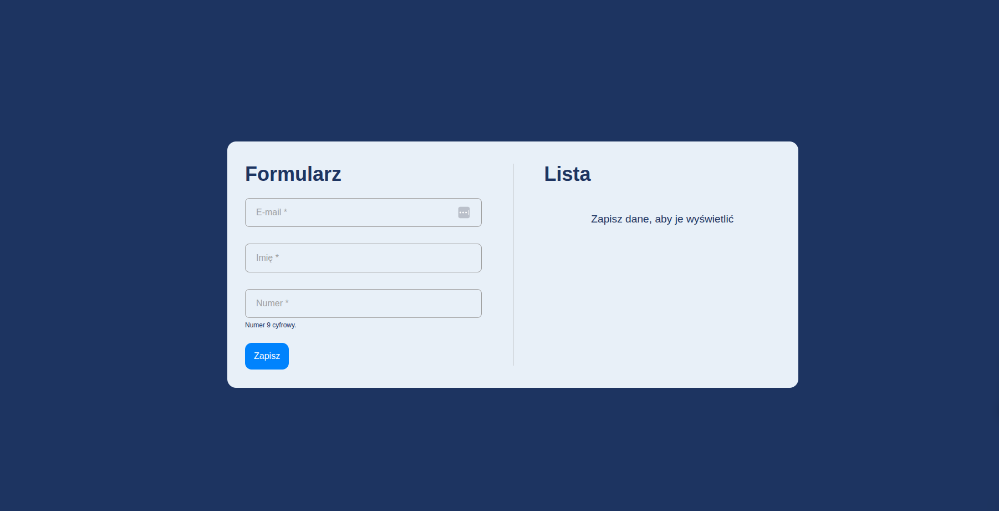
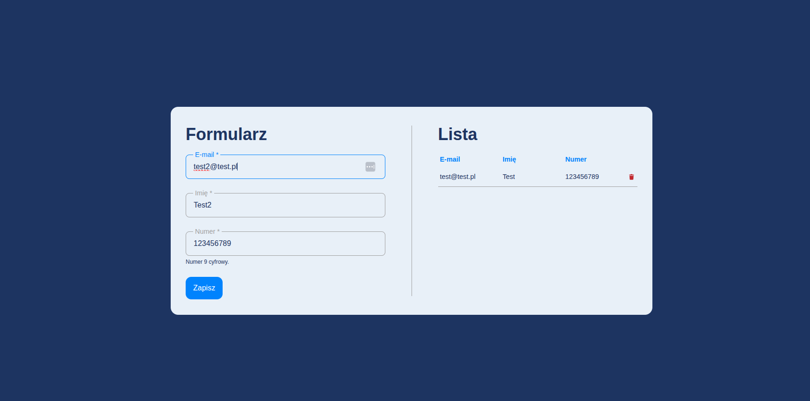
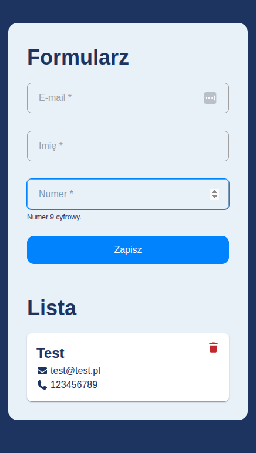

# Form Interview

Aplikacja formularza z walidacją.

#### [Demo](https://form-interview.pages.dev/)

#### Główne kolory:

    base: '#1D3461', // background
    primary: '#0083FD', // button
    secondary: '#E8F0F8', // wrapper

## Uruchomienie projektu

npm install

#### React + TypeScript + Vite + React Hook Forms

### Tryb developerski

npm run dev

### Tryb produkcyjny

npm run build

## Możliwe usprawnienia

#### - Context Api do Confirm Dialog

#### - Obsługa esc, poprawienie focusu do Confirm Dialog

#### - Walidacja duplikatów email

#### - Toast o dodaniu/błędzie

#### - Przerzucenie pozostałych zmiennych do theme.ts

#### - Aktualnie dane zapisywane są w ContextApi, można dodać zapisywanie do localStorage, aby dane nie znikały po odświeżeniu

#### - Dodanie react-i18next do tłumaczeń tekstów

## Screenshots

### Formularz

### Lista

### Mobile

